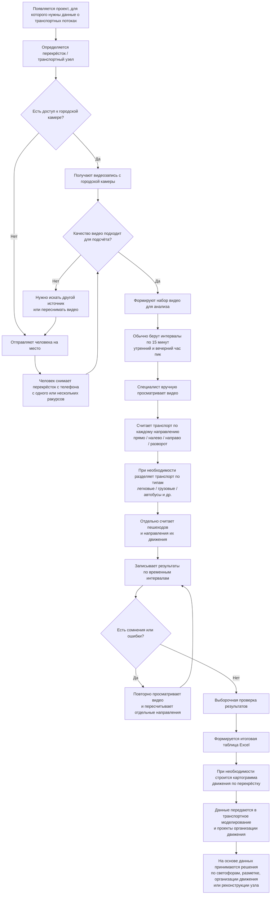

## AS-IS — текущий процесс подсчёта транспортных потоков

### Проблемы AS-IS

- Подсчёт выполняется вручную и занимает в среднем около 5–6 часов на один перекрёсток.
- Чем больше направлений движения, тем дольше идёт обработка.
- Видео приходится останавливать, замедлять и пересматривать.
- Возможны ошибки, поэтому результаты приходится перепроверять.
- Качество исходного видео сильно различается.
- В кадре могут быть ветки, другие объекты и частичные перекрытия.
- Камеры находятся под разными углами, единого ракурса нет.
- При плохом качестве городской камеры приходится отправлять человека на место.
- При больших объёмах видео ручной подсчёт плохо масштабируется.
- Результат в основном сводится вручную в Excel и картограммы.
