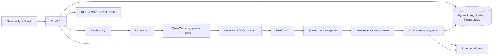

# traffic-analysis

Репозиторий с материалами и рабочим сервисом автоматического анализа
транспортных потоков по видео.

## Документы проекта

| Документ | Ссылка | Что внутри |
|---|---|---|
| AS-IS диаграмма | [AS-IS.md](./AS-IS.md) | Текущий процесс работы: получение или съёмка видео, ручной подсчёт транспорта и пешеходов, проверка результатов, формирование Excel-таблиц и картограмм. |
| Таблица предположений | [Таблица_предложений.md](./Таблица_предложений.md) | Основные предположения по проекту, их текущий статус, основание и способ проверки. |
| Таблица стейкхолдеров | [Таблица_стейкхолдеров.md](./Таблица_стейкхолдеров.md) | Участники проекта, их роли, интересы, влияние на проект и то, что требуется от каждой стороны. |


---

# InnovaTransport · анализ транспортных потоков

Веб-приложение для подсчёта транспорта и пешеходов по видео перекрёстка:
**проект → видео → локальный анализ → направления → Excel**.
Интерфейс на русском. Данные остаются на вашем сервере.

Исходников приложения в предоставленной папке не было. Приложение создано
в `traffic-analysis`; исходный документ «Новая запись 8.docx» сохранён рядом.
Палитра нейтральная, не заявлена как официальная фирменная палитра.
Переменные `--brand-primary`, `--brand-secondary`, `--brand-accent` находятся
в `frontend/src/style.css`; официальный логотип не подменяется вымышленным.

## Установка и первый тест для команды

Этот раздел рассчитан на новый компьютер. Сначала запустите приложение и
проверьте короткое видео; затем переходите к [автоматическим проверкам](#проверки).
Для запуска через Docker отдельно устанавливать Python, Node.js, Redis и
FFmpeg **не нужно** — они находятся в контейнерах.

### 1. Подготовить компьютер и получить проект

- Установите и откройте [Docker Desktop](https://docs.docker.com/desktop/).
  На Windows используйте Linux-контейнеры; при установке выполните требования
  Docker к WSL 2. На Linux подойдёт также Docker Engine с Compose v2.
- Для проверки с обеими Qwen ориентируйтесь на компьютер с 24 ГБ памяти или
  больше. Эта конфигурация проверена на Mac M4 с 24 ГБ; скорость на другом
  оборудовании нужно измерять отдельно. На менее мощном компьютере можно
  начать без Ollama, проверив детектор и интерфейс.
- Заложите ориентировочно 40 ГБ свободного места под модели, образы и сборку,
  плюс место под видео и результаты. Только две Qwen занимают около 13 ГБ.
  Для скачивания зависимостей и моделей потребуется интернет.
- Получите актуальный архив проекта или клонируйте репозиторий команды.
  Откройте терминал **в папке `traffic-analysis`, где лежит `docker-compose.yml`**.
  На macOS/Linux используйте Terminal, на Windows — PowerShell.

Проверьте Docker:

```sh
docker version
docker compose version
```

В первой команде должны быть доступны Client и Server. Ошибка подключения к
daemon означает, что Docker ещё не запущен. Дальнейшие команды выполняйте
из этой же папки проекта, если не указано другое.

### 2. Скачать веса детектора

Файлы `.pt` исключены из Git: клонирования исходников недостаточно.
Скачайте оба файла из официального релиза Ultralytics и сохраните без
переименования в папку `models`:

| Файл | Назначение |
|---|---|
| [yolo11n.pt](https://github.com/ultralytics/assets/releases/download/v8.3.0/yolo11n.pt) | Обязателен для сборки Docker, резервный детектор |
| [yolo11s.pt](https://github.com/ultralytics/assets/releases/download/v8.3.0/yolo11s.pt) | Основной детектор для настроек ниже |

На macOS/Linux это можно сделать командами:

```sh
curl -fL https://github.com/ultralytics/assets/releases/download/v8.3.0/yolo11n.pt -o models/yolo11n.pt
curl -fL https://github.com/ultralytics/assets/releases/download/v8.3.0/yolo11s.pt -o models/yolo11s.pt
```

В Windows используйте те же команды с **`curl.exe`** вместо `curl` либо
скачайте файлы через браузер. Не используйте сохранённую HTML-страницу вместо весов.

### 3. Установить Ollama и загрузить две Qwen

Для полной проверки ИИ установите [Ollama](https://ollama.com/download) на
компьютер и запустите приложение. На Mac с уже установленным Homebrew
вместо приложения можно использовать сервис:

```sh
brew install ollama
brew services start ollama
```

Используйте один способ запуска Ollama. Если установлена только CLI и сервер
не работает, выполните `ollama serve` в отдельном терминале и оставьте его
открытым. **Сначала запустите сервер, затем скачивайте модели:**

```sh
ollama pull qwen3-vl:8b
ollama pull qwen3.5:9b
ollama list
```

В списке должны быть **оба точных имени**, без суффикса `:cloud`. Повторный
`pull` после обрыва загрузки позволяет продолжить скачивание.

### 4. Создать настройки Docker

Создайте текстовый файл **`.env`** рядом с `docker-compose.yml` и вставьте:

```dotenv
LOCAL_VLM_ENABLED=true
LOCAL_VLM_URL=http://host.docker.internal:11434
LOCAL_VLM_SCENE_MODEL=qwen3-vl:8b
LOCAL_VLM_MODEL=qwen3.5:9b
LOCAL_VLM_FRAMES=4
LOCAL_VLM_TIMEOUT=600
MODEL_PATH=/custom-models/yolo11s.pt
```

Если `.env` уже существует, измените соответствующие строки, сохранив остальные
настройки; не добавляйте дубли. На Windows проверьте, что файл не называется
`.env.txt`. **Не копируйте `.env.example` целиком для Docker**: в нём есть пути
для нативной разработки, в частности другой `DATABASE_URL`.

Для первого запуска без Qwen пропустите шаг 3 и укажите
`LOCAL_VLM_ENABLED=false`. Детектор, загрузка и отчёты будут работать, но
нейросетевая проверка не будет выполнена. Чтобы включить её позже, скачайте
обе модели, поменяйте значение на `true` и выполните `docker compose up -d`.

`host.docker.internal` — адрес компьютера из контейнеров Docker Desktop.
Для Docker Engine на Linux выполните настройку из раздела
[«Если что-то не работает»](#если-что-то-не-работает).

### 5. Собрать и запустить

```sh
docker compose config --quiet
docker compose up --build -d
docker compose ps
```

Первая команда при успехе ничего не выводит. Первая сборка может занять
заметное время: скачиваются образы и Python-зависимости. В списке должны
работать `redis`, `api`, `worker` и `frontend`; у `api` и `redis` есть healthcheck.

- [Интерфейс](http://localhost:3000)
- [Swagger / ручная проверка API](http://localhost:8000/docs)
- [Состояние сервиса](http://localhost:8000/health)

Откройте `/health` в браузере. Ожидается `api: true`, `redis: true`,
`workers` не меньше `1`, `model: "/custom-models/yolo11s.pt"`.
Если ИИ включён, в `local_ai` должны быть `enabled: true`, `ready: true`
и пустой список `missing`. Обновление этого статуса кешируется на 15 секунд.
`ready` означает доступность моделей; настоящий вызов проверяется анализом видео.

### 6. Проверить на своём видео

1. Для первого теста возьмите короткое видео перекрёстка, например 15–30 секунд:
   неподвижная камера, дневной свет, хорошо видимые машины и подходы дорог.
2. Нажмите «Новый проект», задайте название, выберите видео и создайте проект.
   Сверьте отображаемые разрешение, FPS и длительность с исходным файлом.
3. Выберите «Сбалансированный» и нажмите «Запустить анализ». Дождитесь
   завершения всех этапов, включая ИИ и подготовку видео для браузера.
   На CPU обработка может идти значительно дольше длительности записи.
4. На вкладке результатов проверьте воспроизведение видео, рамки объектов,
   траектории, таблицу направлений и блок «Проверка нейросетями».
   При включённом ИИ должны быть ответы обеих моделей либо явная причина
   недоступности/неудачного анализа, а не только зелёный статус в боковой панели.
5. Проверьте картограмму и скачайте SVG, PNG, CSV, XLSX и JSON.
   Изображение в экспорте должно соответствовать схеме в интерфейсе,
   а значения — таблице направлений. Для T-перекрёстка не должно появляться
   четвёртого подхода. `unknown` и прочерки допустимы при недостаточных данных.
6. Откройте «Настройка направлений» → «Уточнить схему», укажите центр и
   подходы, нажмите «Сохранить схему и пересчитать». Убедитесь, что схема
   обновилась. Это меняет геометрию по сохранённым трекам, а не исправляет
   пропущенные детектором машины.
7. Для проверки точности вручную посчитайте проезды по направлениям на том
   же отрезке. Загрузите [ручной эталон](#ручной-эталон) и сравните ошибки.
   Самооценка Qwen и успешное завершение задачи не доказывают точность счёта.

Для проверки загрузки повторите тест с настоящими файлами разных форматов
и размеров, например MOV с телефона и MP4 1920×1080. Простое переименование
расширения не меняет контейнер. Поддерживаются MP4, MOV, M4V, MKV, AVI,
WebM, MTS, M2TS; фиксированного требования к разрешению нет, но кодек должен
декодироваться FFmpeg/OpenCV. По умолчанию лимит загрузки — 30 ГБ.
Создавайте отдельный проект на каждый тест: замена видео очищает его старые результаты.

### 7. Остановить или запустить снова

```sh
docker compose down
# При следующем запуске, из папки проекта:
docker compose up -d
```

Проекты сохраняются в Docker-томах. **Не добавляйте `-v` к `down`, если
нужно сохранить видео и результаты.** Ollama запускается отдельно от Compose;
перед следующим анализом убедитесь, что она работает.
После обновления исходников повторите `docker compose up --build -d`.
У каждого сокомандника своя локальная база: ваши проекты и ролики через Git
не передаются, для проверки им понадобится свой файл видео.

## Как работают две локальные модели

Для нативного запуска URL — `http://127.0.0.1:11434`, путь весов —
`models/yolo11s.pt`; переменные нужно экспортировать в окружение процесса.
Файл `.env` автоматически читает Compose, а не Python.

Порядок работы:

1. Qwen3-VL получает до трёх кадров, определяет видимые подходы, центр,
   тип перекрёстка, неподвижность камеры и полноту обзора.
2. Если геометрия не прошла проверку, Qwen3.5 получает кадры для уточнения.
3. YOLO и ByteTrack обнаруживают и отслеживают объекты. Полные траектории
   привязываются к подходам только при достаточной уверенности и полном обзоре.
   В остальных случаях остаются кластеры траекторий и неопределённые направления.
4. Qwen3.5 проверяет выборку кадров с рамками/ID и соответствующие данные
   детектора. Замечания отмечают направления для проверки, но не меняют числа.
5. Картограмма использует эти же подсчитанные потоки. Неизвестные направления
   показаны отдельно; при неподтверждённой геометрии стоят прочерки, а не нули.

Модели работают последовательно, с `keep_alive=0`, без облачных запросов.
Облачные теги Ollama отклоняются. При отключённой/недоступной Ollama подсчёт
детектора продолжится, а интерфейс явно покажет, что проверка не выполнена.
Ответы проходят Pydantic-валидацию. Несогласие моделей и плохое качество
требуют проверки; самооценка модели не является измеренной точностью.

Геометрию можно исправить на вкладке «Настройка направлений»: «Уточнить схему»,
выбрать центр и подходы на кадре, затем «Сохранить схему и пересчитать».
Это использует уже сохранённые треки; распознавание машин заново не запускается.
Проверки Ollama при пересчёте выполняются снова. Для исправления самих
обнаружений нужен полный повторный анализ, например в точном режиме.

Для медленного или ограниченного соединения можно заранее поместить в
`wheelhouse/` полный набор CPU wheels из `requirements.txt` со всеми
зависимостями под **Linux, Python 3.13 и архитектуру целевого контейнера**.
Если там есть torch wheel, CPU-сборка устанавливает этот набор без PyPI;
неполный/несовместимый набор завершится явной ошибкой. По умолчанию каталог
пуст и всё скачивается обычным способом. GPU-сборка использует CUDA index.

Порты приложения привязаны к localhost.
Авторизация не включена: для общего доступа нужен защищённый reverse proxy.

Для NVIDIA GPU на Linux с NVIDIA Container Toolkit:

```sh
docker compose -f docker-compose.yml -f docker-compose.gpu.yml up --build
```

В Docker на Mac детектор использует CPU; Ollama работает нативно на Mac.
При нативном запуске детектор автоматически выбирает CUDA, затем MPS, затем CPU. При ошибке CUDA во время inference выполняется
попытка CPU fallback. Профили Fast / Balanced / Accurate реально меняют
размер inference (480 / 640 / 960), пропуск кадров (3 / 2 / 1) и нижний порог
confidence (.15 / .10 / .08). Модель по умолчанию во всех профилях одна:
это позволяет сравнивать настройки без дополнительных загрузок весов.

## Использование

1. Создайте проект, укажите название и видео (MP4, MOV, M4V, MKV, AVI, WebM, MTS, M2TS).
2. Проверьте длительность, разрешение, FPS, кодек и предупреждения качества.
3. Выберите режим и нажмите «Запустить анализ».
4. Прогресс показывает реальные обработанные кадры, время и устройство.
   ETA появляется после 20 секунд и относится к завершению детекции;
   подготовка браузерного видео выполняется отдельным этапом.
5. Откройте результаты: классы, потоки, интервалы, картограмма и видео.
   Блок «Проверка нейросетями» показывает источник геометрии, замечания моделей
   и статус выполнения. Эвристическая диагностика вынесена отдельно.
6. Переключайте объекты, траектории, зоны и подписи в overlay. Направление
   можно переименовать нажатием на название в таблице.
7. При необходимости нарисуйте зоны въезда/выезда поверх первого кадра.
   Нажимайте для добавления вершин, затем «Завершить зону». Вершины можно
   перетаскивать или редактировать численно. Линия состоит из двух точек.
8. «Сохранить и пересчитать» использует сохранённые треки без повторной детекции.
   Чтобы вернуться к автоматическому режиму, удалите зоны/линии и выберите
   «Вернуть автоопределение» для геометрии.
9. Скачайте XLSX, CSV, JSON, SVG или PNG картограммы.
10. Загрузите ручной эталон, установите свой порог ошибки, сравните результат.
11. Проект можно удалить со всеми видео, треками, эталоном и экспортами.
    Активную задачу сначала отмените; дождитесь освобождения worker.

Один проект содержит одно видео. Замена видео очищает результаты, эталон
и калибровку. Повторный анализ хранит предыдущий результат до успешного
завершения нового, поэтому сбой не уничтожает последнюю готовую версию.

## Возможности

- Автомобили, грузовики, автобусы, мотоциклы, велосипеды, пешеходы.
- Стриминговое декодирование, независимый ByteTrack, bottom-center и EMA.
- Автоматические направления по похожим пространственным траекториям.
- Полигоны въезда/выезда и линии с защитой от дрожания/повторных пересечений.
- Интервалы 15 минут, произвольные 1–1440 минут через API, 5/10/15/30/60 в UI.
- Фоновая очередь RQ, отмена, повторный запуск, диагностика остановки worker.
- Excel: Summary, Movements, Time intervals, Tracks, Metadata.
- JSON включает все компактные траектории; CSV содержит матрицу потоков.
- Интерактивное видео с bbox, ID, классами, зонами и направлением.
- Чёрно-белая картограмма: T-, Y-, четырёхсторонняя или многосторонняя
  схема, стрелки, значения направлений, суммы въезда/выезда. SVG и PNG
  совпадают с изображением на экране. Это условная схема без географической привязки.
- Локальная AI-проверка: определение конфигурации перекрёстка, оценка качества
  видео и согласованности траекторий, безопасная коррекция координат и флаги
  для ручной проверки. Числа при плохом видео не подменяются догадками.
- Сравнение с CSV/XLSX: абсолютная/относительная ошибка, по направлению,
  по классу, итог, сумма абсолютных ошибок и WAPE.

## Архитектура



API не выполняет inference. Worker — отдельный процесс, его можно
масштабировать количеством реплик. SQLite работает в WAL; PostgreSQL
подключается через `DATABASE_URL` и установку `psycopg[binary]`.
API и worker должны использовать одну БД и одно хранилище.

`Storage` задаёт границу хранения. В MVP `LocalStorage` возвращает локальный
путь. Для S3/MinIO adapter должен реализовать staging/cache локального
файла и синхронизацию: OpenCV/SQLite требуют локального рабочего файла.
Готового S3 adapter в этой версии нет.

Результаты одной попытки находятся в `runs/<run_id>`. Публикация идёт
атомарным обновлением ссылки в БД после успешной обработки. Проверка run_id
не позволяет устаревшему worker перезаписать новый запуск. Локальные file
locks защищают замену/удаление видео во время работы. После аварийного
завершения процесс освобождает lock, heartbeat позволяет показать ошибку.

## ML pipeline и правила счёта

1. FFprobe получает metadata, OpenCV проверяет декодирование и четыре
   выборочных кадра на темноту/размытие. Предупреждения не блокируют анализ.
2. Кадры читаются последовательно; никакого списка всего видео в RAM.
   Временные метки берутся из декодера, с fallback на номер кадра/FPS.
3. `Detector.predict` возвращает нормализованные Detection в пикселях кадра.
4. ByteTrack с Kalman filter сохраняет ID при короткой потере объекта.
   Класс трека — взвешенное голосование confidence, а не последний кадр.
5. Bottom-center сглаживается EMA. Сырые bbox/точки/время каждого
   обработанного наблюдения записываются в SQLite. Компактная траектория
   активного трека ограничена ~512 точками; RAM не растёт с длиной видео.
6. Консервативное соединение коротких фрагментов: один кандидат, один класс,
   разрыв до секунды, близкая прогнозируемая позиция и совпадающее движение.
   Одновременные треки и длительный выход/возврат не объединяются.
7. В автоматическом режиме траектории пересэмплируются по длине дуги,
   DBSCAN обучается на детерминированной reservoir-выборке до 4000 треков.
   Автомобильные и пешеходные потоки кластеризуются отдельно. Затем все
   треки назначаются ближайшему подходящему центру. Похожие начальные,
   конечные и промежуточные точки дают направления без угадывания сторон света.
8. Нужно минимум три похожих трека для нового автоматического направления.
   Изолированные, неподвижные, слишком короткие по пути или отличающиеся
   траектории остаются `unknown`; географические названия не генерируются.
9. В ручном режиме движение — первый въезд и последующий выезд. Если заданы
   только линии, используется первое пересечение и его знак. При наличии
   зон линии дают отдельную диагностику, а не дополнительный транспорт.
   В координатах изображения ось Y направлена вниз.
10. Одна подтверждённая траектория учитывается один раз, даже при повторном
    пересечении. Треки менее трёх наблюдений исключаются и показаны в
    диагностике. `unknown` включается в итоги и явно виден в таблице.
    При автоматическом счёте событие относится к последней видимости;
    при ручных зонах — к выходу, при линии — к первому пересечению.
11. Интервалы полуоткрытые `[start, end)`, время от начала записи.
    «Всего транспорта» исключает пешеходов и включает велосипеды.
12. Процент надёжности — геометрическая эвристика; это **не** измеренная
    точность модели и **не** откалиброванная вероятность.

Браузерное видео перекодируется FFmpeg в H.264 без звука; overlay рисуется
на canvas по временным пакетам наблюдений, поэтому его слои можно выключать.
В экспортируемом MP4 overlay не запечён. Исходный контейнер сохраняется без перекодирования (внутреннее имя source.mp4).

## Своя модель без изменения приложения

### YOLO weights / экспортированный YOLO ONNX

Локально:

```sh
DETECTOR=yolo MODEL_PATH=models/my_model.pt python -m worker
# или
DETECTOR=yolo MODEL_PATH=models/model.onnx python -m worker
```

Docker (каталог `models` уже подключён):

```sh
MODEL_PATH=/custom-models/my_model.pt docker compose up --build
```

`MODEL_PATH` в `.env.example` рассчитан на локальный dev. Не копируйте
локальные `DATABASE_URL`/`MODEL_PATH` в Docker без изменения путей.
Для стандартного Docker-запуска `.env` вообще не нужен.

Переименование классов можно передать JSON:

```sh
CLASS_MAP='{"automobile":"car","human":"pedestrian"}' python -m worker
```

Канонические классы: `car, truck, bus, motorcycle, bicycle, pedestrian`.
COCO `person` автоматически нормализуется в `pedestrian`.

### Произвольная PyTorch / ONNX модель

Есть готовый `TensorDetector` для моделей с контрактом:
RGB float32 NCHW `[1,3,H,W]`, диапазон 0–1; выход `[N,6]` или `[1,N,6]`
с колонками `x1,y1,x2,y2,score,class_index` в пикселях resized-входа.
Он выполняет resize, class-wise NMS и обратный перенос координат.
Стандартные YOLO raw-выходы используйте через `DETECTOR=yolo`.

```sh
DETECTOR=torchscript MODEL_PATH=models/model.torchscript python -m worker
DETECTOR=onnx MODEL_PATH=models/model.onnx python -m worker
# Список классов модели в порядке индексов, если отличается от канонического:
MODEL_CLASSES='["person","car","bus"]' DETECTOR=onnx MODEL_PATH=models/model.onnx python -m worker
```


Создайте `ml/detectors/my_detector.py`, наследующий `Detector`.
Адаптер отвечает за resize/letterbox, inference, NMS и обратное отображение
bbox в **пиксели исходного кадра**, затем возвращает `list[Detection]`:

```python
from ml.detectors.base import Detector, Detection, CLASSES

# Ваш класс должен реализовать __init__(profile='balanced') и predict(frame).
# Единый объект результата (пример контракта, не фиктивный detector):
detection = Detection(
    bbox=(x1, y1, x2, y2),
    class_id=CLASSES.index('car'),
    class_name='car',
    confidence=score,
)
```

```sh
DETECTOR=custom CUSTOM_DETECTOR=ml.detectors.my_detector:MyDetector \
  MODEL_PATH=models/my_model.pt python -m worker
```

Для TorchScript используйте `torch.jit.load` внутри адаптера, для ONNX —
`onnxruntime.InferenceSession`. Зависимость ONNX Runtime включена. Произвольный
выход любой нейросети автоматически угадать нельзя: адаптер обязан
декодировать формат конкретной модели. Detector передаётся независимо
от ByteTrack; API, frontend, storage, агрегация и экспорт не меняются.

### Лицензия модели

Ultralytics и его pretrained-модели распространяются под AGPL-3.0 либо
Enterprise-лицензией. Условия нужно учитывать при распространении/развёртывании
продукта. Ссылки: [официальная лицензия](https://www.ultralytics.com/license),
[YOLO11](https://docs.ultralytics.com/models/yolo11/),
[ByteTrack API](https://docs.ultralytics.com/reference/trackers/byte_tracker/).
Не заявляем этот репозиторий как разрешённый для закрытого распространения
независимо от лицензий зависимостей.

## Ручной эталон

Скачайте CSV-шаблон на странице результатов. Формат UTF-8, запятая/точка с
запятой/табуляция; XLSX — первый лист или `Ground truth`:

```csv
movement_id,class,count
auto_1,car,120
auto_1,truck,15
unknown,pedestrian,4
```

Используйте ID из таблицы (они стабильны при переименовании). `count` —
неотрицательное целое. Пропущенные пары не принимаются за нули: сравнение
показывает область покрытия. Явный ноль означает ручной нулевой счёт.
При нулевом эталоне и ненулевом автоматическом результате относительная
ошибка не определена; абсолютная остаётся видимой. После изменения зон
или модели проверьте соответствие ID, при необходимости перезагрузите эталон.
WAPE использует сумму абсолютных ошибок ячеек: ошибки разных направлений
не компенсируют друг друга, в отличие от ошибки общего итога.

## Локальная разработка

Нативный backend ниже рассчитан на macOS/Linux. На Windows используйте
Docker для backend и его тестов; frontend можно разрабатывать через npm.

Python 3.13, Node 22+, FFmpeg/FFprobe, Redis. Python 3.11+ подходит при
совместимом наборе зависимостей; воспроизводимая Docker-сборка использует 3.13.

```sh
python3 -m venv .venv
source .venv/bin/activate
pip install -r requirements-dev.txt
# отдельный терминал:
docker run --rm -p 127.0.0.1:6379:6379 redis:7-alpine
# отдельный терминал:
uvicorn backend.main:app --reload --port 8000
# отдельный терминал:
python -m worker
# отдельный терминал:
cd frontend
npm ci
npm run dev
```

Dev UI: http://localhost:5173, Vite проксирует `/api` на порт 8000.
В каждом новом терминале Python активируйте `.venv` из корня проекта:
`source .venv/bin/activate`. Для API и worker задайте локальный путь весов
`export MODEL_PATH=models/yolo11s.pt`; контейнерный путь `/custom-models/...`
на компьютере не существует. Для нативной проверки Qwen дополнительно
экспортируйте `LOCAL_VLM_ENABLED=true`, `LOCAL_VLM_URL=http://127.0.0.1:11434`,
`LOCAL_VLM_SCENE_MODEL=qwen3-vl:8b` и `LOCAL_VLM_MODEL=qwen3.5:9b`.
Переменные задаются в окружении процесса; Python сам `.env` не загружает.
На macOS worker использует RQ SimpleWorker во избежание fork-проблем native CV.
На Linux — обычный RQ Worker. Состояния: uploaded, queued, processing,
completed, failed, cancelled. Проект до загрузки также uploaded, но UI
показывает «Нет видео», и анализ заблокирован.

## API

Основные маршруты (без `/api` при прямом обращении на порт 8000):

| Метод | Маршрут | Назначение |
|---|---|---|
| POST / GET | `/projects` | Создать / получить проекты |
| GET / DELETE | `/projects/{id}` | Детали / удалить данные |
| POST | `/projects/{id}/video` | Multipart video: MP4/MOV/M4V/MKV/AVI/WebM/MTS/M2TS |
| POST / GET | `/projects/{id}/analysis` | Запуск / прогресс |
| POST | `/projects/{id}/analysis/cancel` | Отмена |
| GET / PUT | `/projects/{id}/calibration` | Зоны и линии |
| GET | `/projects/{id}/results` | Сводка |
| GET | `/projects/{id}/movements` | Направления |
| PATCH | `/projects/{id}/movements/{movement_id}` | Переименовать |
| GET | `/projects/{id}/intervals?minutes=15` | Интервалы |
| GET | `/projects/{id}/tracks?offset=0&limit=100` | Траектории с пагинацией |
| GET | `/projects/{id}/overlay?start=0&seconds=5` | Наблюдения для плеера |
| GET | `/projects/{id}/media/{source,preview,playback}` | Видео/превью, HTTP Range |
| POST | `/projects/{id}/ground-truth` | Multipart CSV/XLSX |
| GET | `/projects/{id}/ground-truth/template` | Шаблон |
| GET | `/projects/{id}/validation?threshold=10` | Ошибки |
| GET | `/projects/{id}/export/{xlsx,csv,json,svg}` | Отчёт |

Документация со схемами и Try it out: `/docs`; машинная схема: `/openapi.json`.

## Структура

```text
backend/         FastAPI, SQLAlchemy, storage, видео, валидация, экспорт
ml/detectors/    Контракт Detection/Detector, YOLO, factory custom adapters
ml/trackers/     Независимый ByteTrack
ml/geometry.py  Зоны, пересечения, пересэмплирование
ml/movements.py Классификация, агрегация, интервалы
ml/pipeline.py  Потоковая обработка, траектории, соединение фрагментов
ml/artifacts.py SQLite наблюдения и траектории
worker/         Очередь, heartbeat, отмена, публикация результатов
frontend/       React, TypeScript, CSS, Vite, nginx
models/         Ваши веса (не включены в git)
tests/          Unit, API и integration tests без скачивания модели
scripts/        Smoke-проверки настоящей модели
docs/           Исходное интервью, решения и контекст
```

## Проверки

### Автоматические тесты backend

После сборки Docker можно проверить код без установки Python на компьютер.
Следующая команда выполняется **одной строкой** из корня проекта и подходит
для Terminal и PowerShell:

```sh
docker compose run --rm --no-deps -e LOCAL_VLM_ENABLED=false -v ./tests:/app/tests:ro -v ./requirements-dev.txt:/app/requirements-dev.txt:ro api sh -c "python -m pip install -r requirements-dev.txt && python -m pytest -q && python -m ruff check backend ml worker tests scripts"
```

Команда создаёт временный контейнер, устанавливает тестовые зависимости,
проверяет backend/ML/API и стиль Python. Тесты используют отдельную временную
БД и тестовые детекторы, не вызывают Qwen и не измеряют качество реальной YOLO.
Тестовые видео создаются автоматически; FFmpeg уже есть в образе.
После изменения Python-кода сначала пересоберите образ: `docker compose build api`.

Если уже подготовлено окружение из раздела [«Локальная разработка»](#локальная-разработка),
эти же проверки можно выполнить в активированной `.venv`:

```sh
python -m pytest -q
python -m ruff check backend ml worker tests scripts
```

При успешной проверке нет `FAILED` и ошибок Ruff. На 24.09.2026 прошли
54 теста; подробности и границы проверки — в [протоколе](docs/VERIFICATION.md).

### Сборка и браузерная проверка frontend

Для этих команд нужен Node.js 22+ с npm на компьютере. Для обычного запуска
приложения он не нужен: Docker уже собирает frontend.

```sh
cd frontend
npm ci
npm run build
npx playwright install chromium
```

Оставьте приложение запущенным через Docker. Затем в этом же терминале
задайте адрес для браузерных тестов и запустите их.

macOS/Linux:

```sh
E2E_URL=http://localhost:3000 npm run test:e2e
```

Windows PowerShell:

```powershell
$env:E2E_URL = "http://localhost:3000"
npm run test:e2e
```

Без `E2E_URL` тесты ожидают dev frontend на порту `5173`. Текущий сценарий
проверяет форму создания проекта, отсутствие ошибок JavaScript и
горизонтального переполнения на desktop/mobile. Он не запускает анализ видео.
После проверки вернитесь в корень проекта командой `cd ..`.

### Полная проверка API с настоящим видео

Этот сценарий требует работающих API, Redis и worker, а для проверки ИИ —
ещё и включённой Ollama с обеими моделями. Скрипт использует `httpx` и
`openpyxl`: они входят в `requirements-dev.txt`. Выполняйте команды из корня
проекта в активированной `.venv` из раздела «Локальная разработка».
Замените путь после `--video` на свой существующий файл; пути с пробелами
оставляйте в кавычках.

```sh
python scripts/http_smoke.py --video "/path/to/intersection.mov" --timeout 3600
```

Адрес по умолчанию — `http://localhost:3000/api`; для другого сервера передайте
`--base-url`. Скрипт создаёт отдельный проект «Проверка Docker · реальное видео»,
загружает ролик, ждёт анализа, проверяет XLSX/CSV/JSON/SVG и чтение видео через
HTTP Range. Успешное завершение выводит JSON с `project_id`, `counts` и
`exports`; выгрузки сохраняются в `data/http-smoke/`.

**Проект остаётся в приложении** для просмотра и ручной проверки ИИ/картограммы.
Пересчёт, PNG и удаление этот скрипт не проверяет. Если истёк `--timeout`,
задание не отменяется: откройте проект и посмотрите его состояние перед
повторным запуском скрипта. Каждый новый запуск создаёт новый проект.

Отдельно можно проверить только реальный детектор и трекинг без API и Qwen:

```sh
export MODEL_PATH=models/yolo11s.pt
python scripts/real_model_smoke.py --video "/path/to/intersection.mp4" --output data/real-smoke
```

MockDetector используется только в тестах. Интеграционные тесты создают настоящий
MP4, применяют настоящий ByteTrack, строят и сохраняют траектории. Загрузка
принимает MP4, MOV, M4V, MKV, AVI, WebM, MTS и M2TS; видео декодируется
через FFmpeg/OpenCV, а для браузера
после анализа готовится совместимый H.264 MP4. HTTP smoke
проходит upload → worker → результаты → экспорт → проверка воспроизведения.
Синтетическое видео не служит доказательством точности на перекрёстке.

## Если что-то не работает

Сначала выполните из папки проекта:

```sh
docker compose ps
docker compose logs --tail=100 api worker frontend
```

Для наблюдения за обработкой: `docker compose logs -f worker`.
`Ctrl+C` завершает просмотр логов и не останавливает сервис.

| Симптом | Что проверить и сделать |
|---|---|
| `Cannot connect to the Docker daemon` | Открыть Docker Desktop и дождаться запуска; на Linux запустить Docker Engine. Проверить `docker version`. |
| Сборка не находит `models/yolo11n.pt` | Скачать веса из шага 2. Этот файл нужен даже при выбранном YOLO11s. |
| Ошибка установки wheels, `not a supported wheel` | При переносе архивом не переносить чужой `wheelhouse` между ARM64 и x86_64. Переместить файлы `.whl` из него за пределы проекта, оставить `.gitkeep` и повторить сборку с доступом к интернету. |
| Порт `3000` или `8000` занят | Остановить прежний экземпляр приложения или другой процесс на этом порту; затем повторить `docker compose up -d`. |
| `could not connect to ollama server` | Запустить приложение Ollama, `brew services start ollama` на Mac с Homebrew или `ollama serve` в отдельном терминале. Не запускать второй сервер, если порт уже занят. |
| `local_ai.ready: false` | Проверить `ollama list`, оба имени моделей и URL в `.env`. После изменения `.env` выполнить `docker compose up -d` и обновить `/health` через 15 секунд. |
| На компьютере Ollama работает, но контейнер её не видит | В Docker нужен `host.docker.internal`, а не `localhost`. Проверить привязку адреса Ollama и межсетевой экран; для Linux см. ниже. |
| `workers: 0`, задача остаётся в очереди | Посмотреть логи `worker` и `api`, проверить наличие весов и состояние `redis`. После устранения причины выполнить `docker compose up -d worker`. |
| Не хватает памяти или ИИ не укладывается в timeout | Закрыть другие тяжёлые приложения, проверить короткий ролик. Для проверки остальных функций временно задать `LOCAL_VLM_ENABLED=false` и пересоздать контейнеры командой `docker compose up -d`. |
| Видео не воспроизводится до анализа | Исходный кодек может не поддерживаться браузером. После успешного анализа создаётся версия H.264. При ошибке загрузки проверить, что исходный файл открывается и не повреждён. |
| Мало машин, много `unknown`, схема требует проверки | Посмотреть рамки и траектории, проверить обзор и качество видео, попробовать «Точный» режим, уточнить подходы вручную. Число треков не равно гарантированному числу проездов; сравнить с ручным эталоном. |

### Docker Engine на Linux и Ollama на хосте

В Docker Desktop имя `host.docker.internal` предусмотрено средой. В обычном
Docker Engine на Linux добавьте файл `docker-compose.override.yml` рядом с
основным Compose-файлом:

```yaml
services:
  api:
    extra_hosts:
      - "host.docker.internal:host-gateway"
  worker:
    extra_hosts:
      - "host.docker.internal:host-gateway"
```

Ollama должна принимать соединения с Docker-сети: её стандартная привязка
к `127.0.0.1` для этого недостаточна. Для установки через systemd выполните
`sudo systemctl edit ollama.service` и добавьте:

```ini
[Service]
Environment="OLLAMA_HOST=0.0.0.0:11434"
```

Сохраните файл, затем:

```sh
sudo systemctl daemon-reload
sudo systemctl restart ollama
docker compose up -d
```

Адрес `0.0.0.0` открывает Ollama на сетевых интерфейсах: ограничьте доступ
к порту `11434` локальным компьютером и Docker-сетью через межсетевой экран.
Способы настройки для разных ОС описаны в
[документации Ollama](https://docs.ollama.com/faq#how-do-i-configure-ollama-server).
После настройки снова проверьте `local_ai` в `/health`.

Если нужна помощь команды, приложите ОС/архитектуру, вывод `docker compose ps`,
JSON `/health`, последние строки логов и параметры проблемного видео
(контейнер, кодек, разрешение, длительность). Укажите этап и текст ошибки.

## Реальные ограничения

- Универсальная точность при плотных окклюзиях, движущейся камере, плохой
  погоде, мелких объектах и частых ID-switch не гарантируется. Требуется
  проверка на вручную обсчитанных видео заказчика.
- Длительный выход объекта из кадра и его возвращение не позволяет
  установить физическую идентичность без дополнительных признаков.
  Это новый трек. Короткие потери восстанавливаются насколько позволяет
  ByteTrack/геометрия. Абсолютной защиты от fragmentation нет.
- Парковавшиеся/неподвижные подтверждённые объекты попадают в unknown и
  включены в общий наблюдаемый счёт; для проездов используйте таблицу
  направлений и ручные зоны. Это не оценка пропускной способности сама по себе.
- Без достоверной геометрии автоматические направления требуют повторяющихся траекторий. Редкие
  развороты и неполные пути могут остаться unknown. Конфигурация калибровки
  применяется ко всем классам; отдельные правила пешеходных зон не введены.
- Пределы памяти заданы для треков/обучения, но место под наблюдения растёт
  с длительностью и числом объектов. Суточная запись возможна архитектурно,
  но нагрузочный прогон на 24 часах не заменяется коротким smoke-тестом.
- Overlay выдаёт до 50 000 наблюдений на временной пакет; экстремально
  плотные сцены могут потребовать уменьшения окна API.
- Во время первого предпросмотра браузер может не поддерживать исходный
  кодек исходного видео. После анализа доступна совместимая версия H.264.
- Нет идентификации людей/лиц, OCR номеров, multi-camera re-ID, GIS,
  облачного storage adapter, авторизации и live RTSP.
- Экспорт Tracks XLSX ограничен лимитом Excel 32767 символов в ячейке
  траектории; JSON содержит полную компактную траекторию.

## Документация проекта

- [AS-IS](docs/AS-IS.md)
- [Таблица предположений](docs/Таблица_предположений.md)
- [Таблица стейкхолдеров](docs/Таблица_стейкхолдеров.md)
- [Расшифровка исходного интервью](docs/interview.txt)
- [План и решения реализации](docs/IMPLEMENTATION.md)
- [Протокол проверок](docs/VERIFICATION.md)
