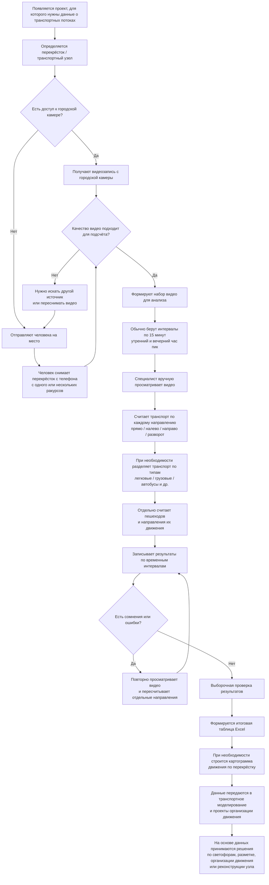

## AS-IS — текущий процесс подсчёта транспортных потоков

```mermaid
flowchart TD
    A[Появляется проект, для которого нужны данные о транспортных потоках]
    --> B[Определяется перекрёсток / транспортный узел]

    B --> C{Есть доступ к городской камере?}

    C -->|Да| D[Получают видеозапись с городской камеры]
    C -->|Нет| E[Отправляют человека на место]

    E --> F[Человек снимает перекрёсток с телефона<br/>с одного или нескольких ракурсов]

    D --> G{Качество видео подходит для подсчёта?}
    F --> G

    G -->|Нет| H[Нужно искать другой источник<br/>или переснимать видео]
    H --> E

    G -->|Да| I[Формируют набор видео для анализа]

    I --> J[Обычно берут интервалы по 15 минут<br/>утренний и вечерний час пик]

    J --> K[Специалист вручную просматривает видео]

    K --> L[Считает транспорт по каждому направлению<br/>прямо / налево / направо / разворот]

    L --> M[При необходимости разделяет транспорт по типам<br/>легковые / грузовые / автобусы и др.]

    M --> N[Отдельно считает пешеходов<br/>и направления их движения]

    N --> O[Записывает результаты по временным интервалам]

    O --> P{Есть сомнения или ошибки?}

    P -->|Да| Q[Повторно просматривает видео<br/>и пересчитывает отдельные направления]
    Q --> O

    P -->|Нет| R[Выборочная проверка результатов]

    R --> S[Формируется итоговая таблица Excel]

    S --> T[При необходимости строится картограмма<br/>движения по перекрёстку]

    T --> U[Данные передаются в транспортное моделирование<br/>и проекты организации движения]

    U --> V[На основе данных принимаются решения<br/>по светофорам, разметке, организации движения<br/>или реконструкции узла]
```
